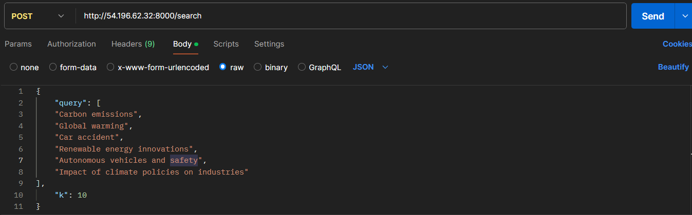

# SBERT-Based Search Relevance Enhancement

## 🌟 Project Overview  
This project aims to improve search relevance by utilizing **Sentence-BERT (SBERT)** for generating semantic embeddings and the **ANNOY** library for quick approximate nearest neighbor searches. The solution is deployed on **AWS** with **Docker** containers, providing an accessible **FastAPI** for easy interaction and retrieval of highly relevant news articles.

---

## 🎯 Objective  
The primary goal is to refine the user search experience for news articles by implementing:  
1. **SBERT** to create contextual embeddings that capture the meaning behind article content.  
2. **ANNOY** to efficiently perform similarity searches with embeddings.  
3. **AWS** for scalable, cloud-based deployment of the application.

---

## 📚 Dataset Overview  
The dataset contains 13,320 articles, each with the following attributes:  
- **article_id**: Unique identifier for each news piece.  
- **category**/**subcategory**: High-level and detailed topic classifications.  
- **title**: A brief headline summarizing the article.  
- **published_date**: The date the article was released.  
- **text**: The full text of the article.  
- **source**: The originating publication or source.
  

---

## 🧰 Technology Stack  
- **Programming Language**: Python  
- **Key Libraries**: `pandas`, `numpy`, `,ltk`, `sentence-transformers`, `annoy`, `fastapi`, `AWS`  
- **Cloud Deployment**: AWS EC2  
- **Containerization**: Docker  

---

## 📝 Input  
- **query**: A list of sentences or keywords for the search query.  
- **k**: The number of top-k most relevant articles to retrieve based on the query.  

---

## 📤 Output  
The output consists of each input query paired with the top-k most relevant articles, ranked by their similarity to the query.  

